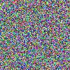
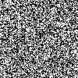

# PixHobby

This is a collection of simple scripts that generate some funky pixel/ascii_char stuff. New projects are added gradually
## Project list 
- [Noise generator](https://github.com/TimofeyTvorogov/PixHobby/blob/main/noise_generator.py)
- [Ascii image converter](https://github.com/TimofeyTvorogov/PixHobby/blob/main/img_to_ascii.py)
 - other scripts (sometime in future)

## Noise_generator examples, colorful and noir:

 

## Ascii converter example:
[mona lisa](./ascii_image.txt)